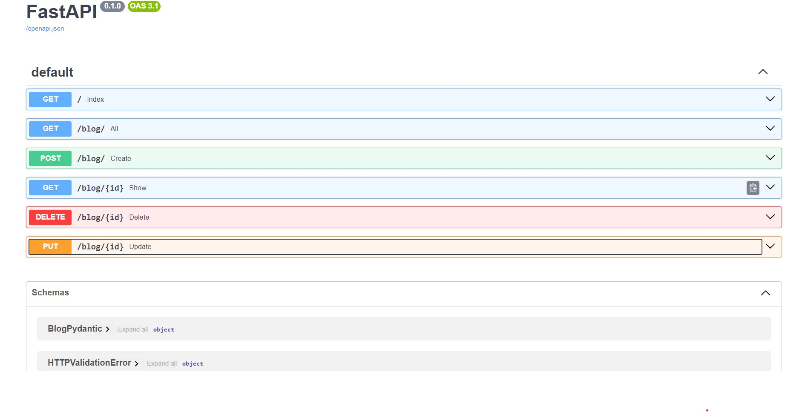

## Blog-Api-FastAPI 
I will be learning `FastAPI` with `DataBase(Sqlite)` , `SqlALchemy`. Created `Crud API` for `blog`.
**INFO** : Go in noor1CrudWithDB/noor2 branch you will get the CRUD api for blog
### CRUD :
- `Create` Blog
- `Show All` blogs
- `Show single blog` with desired id
- `Delete` Blog with desired id
- `Update` Blog with desired id  
**NOTE :** `Handled Exception` very well with meaningful message if something get wrong.

### How branch is made in serialwise:

1- testing  
2- noor1CrudWithDB  
3- noor2 : made some chnages in noor1CrudWithDB branch  
4- noor3 : correted the routing name and function  
5- user : created user table and 3 routes - create , show and show particular user  
6- relationship : made relationship with user and blog table with PK-FK  
7- Apirouter: Curruntly working  
